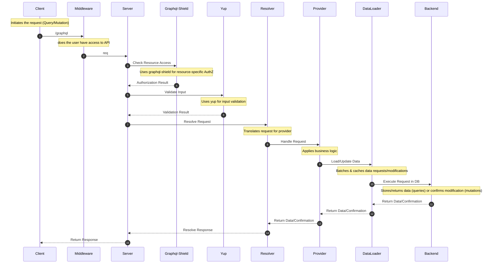

# Setup local environment

Copy `sample.env` and rename it to `.env`. Ask a dev for the values.

## Development

```bash
$ npm install
$ npm run dev
$ open http://localhost:3001/api/graphql # opens graphql server
```

## Codegen

```bash
npm run codegen
```

<br /><br />

# Knowns issue

- GraphQL types issue
  - If you see a GraphQL error in resolver regarding `root, args, context` types. Open the `src/routes/graphql/types/graphql.ts` file and it should auto-resolve!

<br /><br />

# GraphQL

## Query/Mutation


